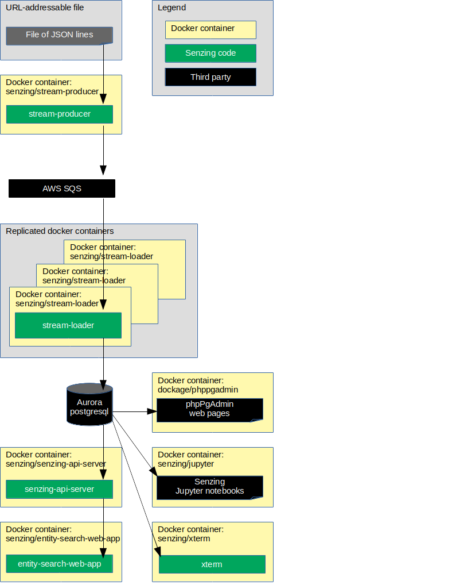

# docker-compose-aws-ecscli-demo-advanced

## Overview

This illustrates a reference implementation of Senzing using
AWS Simple Queue Service (SQS) as the queue and
AWS Aurora/PostgreSQL Serverless as the underlying database
on the Amazon Elastic Container Service (ECS) in Fargate mode.

The instructions show how to set up a system that:

1. Reads JSON lines from a file on the internet.
1. Sends each JSON line to a message queue.
    1. In this implementation, the queue is AWS SQS.
1. Reads messages from the queue and inserts into Senzing.
    1. In this implementation, Senzing keeps its data in an AWS Aurora/PostgreSQL Serverless database.
1. Reads information from Senzing via [Senzing REST API](https://github.com/Senzing/senzing-rest-api-specification) server.
1. Views resolved entities in a [web app](https://github.com/Senzing/entity-search-web-app).

The following diagram shows the relationship of the docker containers in this docker composition.
Arrows represent data flow.



This docker formation brings up the following docker containers:

1. *[dockage/phppgadmin](https://hub.docker.com/r/dockage/phppgadmin)*
1. *[senzing/debug](https://github.com/Senzing/docker-senzing-debug)*
1. *[senzing/entity-web-search-app](https://github.com/Senzing/entity-search-web-app)*
1. *[senzing/init-container](https://github.com/Senzing/docker-init-container)*
1. *[senzing/jupyter](https://github.com/Senzing/docker-jupyter)*
1. *[senzing/senzing-api-server](https://github.com/Senzing/senzing-api-server)*
1. *[senzing/stream-loader](https://github.com/Senzing/stream-loader)*
1. *[senzing/stream-producer](https://github.com/Senzing/stream-producer)*
1. *[senzing/xterm](https://github.com/Senzing/docker-xterm)*

## Contents

1. [Prerequisites](#prerequisites)
    1. [Install AWS CLI](#install-aws-cli)
    1. [Install ECS CLI](#install-ecs-cli)
    1. [Clone repository](#clone-repository)
1. [Tutorial](#tutorial)
    1. [Authentication](#authentication)
    1. [Identify metadata](#identify-metadata)
        1. [AWS metadata](#aws-metadata)
        1. [Identify project](#identify-project)
        1. [Database credentials](#database-credentials)
        1. [EULA](#eula)
        1. [Synthesize variables](#synthesize-variables)
    1. [Make AWS project directory](#make-aws-project-directory)
    1. [Configure ECS CLI](#configure-ecs-cli)
    1. [Create cluster](#create-cluster)
    1. [Save cluster metadata](#save-cluster-metadata)
    1. [Find security group ID](#find-security-group-id)
    1. [Open inbound ports](#open-inbound-ports)
    1. [Create backing services](#create-backing-services)
        1. [Provision Elastic File System](#provision-elastic-file-system)
        1. [Provision Aurora PostgreSQL Serverless](#provision-aurora-postgresql-serverless)
        1. [Provision Simple Queue Service](#provision-simple-queue-service)
        1. [Provision Dead Letter Simple Queue Service](#provision-dead-letter-simple-queue-service)
    1. [Run tasks](#run-tasks)
        1. [Run EFS init container task](#run-efs-init-container-task)
        1. [Run install Senzing task](#run-install-senzing-task)
        1. [Run create Senzing database schema task](#run-create-senzing-database-schema-task)
        1. [Run init-container task](#run-init-container-task)
        1. [Run Stream producer task](#run-stream-producer-task)
    1. [Create services](#create-services)
        1. [Create sshd service](#create-sshd-service)
        1. [Create Stream loader service](#create-stream-loader-service)
        1. [Create Redoer service](#create-redoer-service)
        1. [Create Senzing API server service](#create-senzing-api-server-service)
        1. [Create Senzing Web App service](#create-senzing-web-app-service)
        1. [Create Senzing X-Term service](#create-senzing-x-term-service)
        1. [Create phpPgAdmin service](#create-phppgadmin-service)
        1. [Create Jupyter notebook service](#create-jupyter-notebook-service)
    1. [Autoscale services](#autoscale-services)
        1. [Autoscale Stream loader service](#autoscale-stream-loader-service)
    1. [Service recap](#service-recap)
1. [Cleanup](#cleanup)
    1. [Delete services](#delete-services)
    1. [Delete tasks definitions](#delete-tasks-definitions)
    1. [Bring down cluster](#bring-down-cluster)
    1. [Delete Simple Queue Service](#delete-simple-queue-service)
    1. [Delete Aurora PostgreSQL](#delete-aurora-postgresql)
    1. [Delete Elastic File System](#delete-elastic-file-system)
    1. [Clean logs](#clean-logs)
    1. [Review cleanup in AWS console](#review-cleanup-in-aws-console)
1. [References](#references)
1. [Troubleshooting](#troubleshooting)

## Prerequisites

### Install AWS CLI

To install `aws`, see
[How to install Amazon Web Service Command Line Interface](https://github.com/Senzing/knowledge-base/blob/master/HOWTO/install-aws-cli.md).

### Install ECS CLI

To install `ecs-cli`, see
[How to install Amazon Web Service Elastic Compute Service Command Line Interface](https://github.com/Senzing/knowledge-base/blob/master/HOWTO/install-aws-ecs-cli.md).

### Clone repository

For more information on environment variables,
see [Environment Variables](https://github.com/Senzing/knowledge-base/blob/master/lists/environment-variables.md).

1. Set these environment variable values:

    ```console
    export GIT_ACCOUNT=senzing
    export GIT_REPOSITORY=docker-compose-aws-ecscli-demo
    export GIT_ACCOUNT_DIR=~/${GIT_ACCOUNT}.git
    export GIT_REPOSITORY_DIR="${GIT_ACCOUNT_DIR}/${GIT_REPOSITORY}"
    ```

1. Using the environment variables values just set, follow steps in [clone-repository](https://github.com/Senzing/knowledge-base/blob/master/HOWTO/clone-repository.md) to install the Git repository.

## Tutorial

### Authentication

1. Create an
   [AWS session](https://github.com/Senzing/knowledge-base/blob/master/HOWTO/set-aws-environment-variables.md#aws-session).
1. :pencil2: Set the following AWS environment variables:
    1. [AWS_ACCESS_KEY_ID](https://github.com/Senzing/knowledge-base/blob/master/HOWTO/set-aws-environment-variables.md#aws_access_key_id)
    1. [AWS_SECRET_ACCESS_KEY](https://github.com/Senzing/knowledge-base/blob/master/HOWTO/set-aws-environment-variables.md#aws_secret_access_key)
    1. [AWS_SESSION_TOKEN](https://github.com/Senzing/knowledge-base/blob/master/HOWTO/set-aws-environment-variables.md#aws_session_token)
1. :thinking: **Optional:**
   If multi-factor authentication is used to access AWS,
   see [How to set AWS multi-factor authentication credentials](https://github.com/Senzing/knowledge-base/blob/master/HOWTO/set-aws-mfa-credentials.md).

### Identify metadata

#### AWS metadata

1. :pencil2: Set AWS [region](https://docs.aws.amazon.com/AWSEC2/latest/UserGuide/using-regions-availability-zones.html).
    1. Set [AWS_DEFAULT_REGION](https://github.com/Senzing/knowledge-base/blob/master/HOWTO/set-aws-environment-variables.md#aws_default_region)
1. :pencil2: Set AWS [key pair](https://docs.aws.amazon.com/AWSEC2/latest/UserGuide/ec2-key-pairs.html).
   Example:

    ```console
    export SENZING_AWS_KEYPAIR=aws-default-key-pair
    ```

#### Identify project

1. :pencil2: Choose a prefix used in AWS object names.
   This will also be the name of a directory storing AWS output.
   See [Make AWS project directory](#make-aws-project-directory).
   Example:

    ```console
    export SENZING_AWS_PROJECT=senzing-1
    ```

#### Database credentials

1. :pencil2: Create username/password for the AWS Aurora-PostgreSQL database master user.
   Example:

    ```console
    export POSTGRES_USERNAME=senzing
    export POSTGRES_PASSWORD=password
    ```

#### EULA

To use the Senzing code, you must agree to the End User License Agreement (EULA).

1. :warning: This step is intentionally tricky and not simply copy/paste.
   This ensures that you make a conscious effort to accept the EULA.
   Example:

    <pre>export SENZING_ACCEPT_EULA="&lt;the value from <a href="https://github.com/Senzing/knowledge-base/blob/master/lists/environment-variables.md#senzing_accept_eula">this link</a>&gt;"</pre>

#### Synthesize variables

1. Create additional environment variables.
   Example:

    ```console
    export SENZING_AWS_LOGS_GROUP=${SENZING_AWS_PROJECT}-log-group
    export SENZING_AWS_ECS_CLUSTER=${SENZING_AWS_PROJECT}-cluster
    export SENZING_AWS_ECS_CLUSTER_CONFIG=${SENZING_AWS_PROJECT}-config-name
    ```

### Make AWS project directory

1. Make a new directory to handle AWS output.
   Example:

    ```console
    export SENZING_AWS_PROJECT_DIR=~/${SENZING_AWS_PROJECT}
    mkdir ${SENZING_AWS_PROJECT_DIR}
    ```

### Configure ECS CLI

1. Run
   [ecs-cli](https://docs.aws.amazon.com/AmazonECS/latest/developerguide/ECS_CLI_reference.html)
   [configure](https://docs.aws.amazon.com/AmazonECS/latest/developerguide/cmd-ecs-cli-configure.html)
   to configure Elastic Container System (ECS) Command Line Interface (CLI).
   Example:

    ```console
    ecs-cli configure \
       --cluster ${SENZING_AWS_ECS_CLUSTER} \
       --config-name ${SENZING_AWS_ECS_CLUSTER_CONFIG} \
       --default-launch-type FARGATE \
       --region ${AWS_DEFAULT_REGION}
    ```

1. :thinking: **Optional:**
   To view configuration values, see `~/.ecs/config`.

    ```console
    cat ~/.ecs/config
    ```

### Create cluster

1. Run
   [ecs-cli](https://docs.aws.amazon.com/AmazonECS/latest/developerguide/ECS_CLI_reference.html)
   [up](https://docs.aws.amazon.com/AmazonECS/latest/developerguide/cmd-ecs-cli-up.html)
   to create ECS Fargate cluster.
   Example:

    ```console
    ecs-cli up \
      --cluster-config ${SENZING_AWS_ECS_CLUSTER_CONFIG} \
      --force \
      | tee ${SENZING_AWS_PROJECT_DIR}/ecs-cli-up.txt
    ```

1. :thinking: **Optional:**
   View aspects of AWS ECS cluster in AWS console.
    1. [cloudformation](https://console.aws.amazon.com/cloudformation/home?#/stacks)
    1. [ecs](https://console.aws.amazon.com/ecs/home)
    1. [vpc](https://console.aws.amazon.com/vpc/home)
        1. [internet gateways](https://console.aws.amazon.com/vpc/home?#igws)
        1. [network acls](https://console.aws.amazon.com/vpc/home?#acls)
        1. [route tables](https://console.aws.amazon.com/vpc/home?#RouteTables)
        1. [security groups](https://console.aws.amazon.com/vpc/home?#SecurityGroups)
        1. [subnets](https://console.aws.amazon.com/vpc/home?#subnets)
        1. [vpc](https://console.aws.amazon.com/vpc/home?#vpcs)

### Save cluster metadata

1. Set environment variable with VPC ID.
   Example:

    ```console
    export SENZING_AWS_VPC_ID=$(awk '/VPC created/{print $3}' ${SENZING_AWS_PROJECT_DIR}/ecs-cli-up.txt)
    ```

1. Set environment variable with Subnet #1
   Example:

    ```console
    export SENZING_AWS_SUBNET_ID_1=$(awk '/Subnet created/{print $3}' ${SENZING_AWS_PROJECT_DIR}/ecs-cli-up.txt | awk 'NR==1')
    ```

1. Set environment variable with Subnet #2
   Example:

    ```console
    export SENZING_AWS_SUBNET_ID_2=$(awk '/Subnet created/{print $3}' ${SENZING_AWS_PROJECT_DIR}/ecs-cli-up.txt | awk 'NR==2')
    ```

1. :thinking: **Optional:**
   Review environment variables.
   Example:

    ```console
    env | grep SENZING | sort
    ```

### Find security group ID

1. Run
   [aws](https://awscli.amazonaws.com/v2/documentation/api/latest/reference/index.html)
   [ec2](https://awscli.amazonaws.com/v2/documentation/api/latest/reference/ec2/index.html)
   [describe-security-groups](https://awscli.amazonaws.com/v2/documentation/api/latest/reference/ec2/describe-security-groups.html)
   to find the AWS security group.
   Example:

    ```console
    aws ec2 describe-security-groups \
      --filters Name=vpc-id,Values=${SENZING_AWS_VPC_ID} \
      --region ${AWS_DEFAULT_REGION} \
      > ${SENZING_AWS_PROJECT_DIR}/aws-ec2-describe-security-groups.json
    ```

1. Save security group ID in `SENZING_AWS_EC2_SECURITY_GROUP` environment variable.
   Example:

    ```console
    export SENZING_AWS_EC2_SECURITY_GROUP=$(jq --raw-output ".SecurityGroups[0].GroupId" ${SENZING_AWS_PROJECT_DIR}/aws-ec2-describe-security-groups.json)
    ```

1. :thinking: **Optional:**
   View security group ID.
   Example:

    ```console
    echo ${SENZING_AWS_EC2_SECURITY_GROUP}
    ```

### Open inbound ports

:warning: **Warning:** The following inbound port specifications are **wide open**.
Meaning they can be accessed from anywhere.
For demonstration purposes, this is fine.
For production purposes it is not fine.

1. Run
   [aws](https://awscli.amazonaws.com/v2/documentation/api/latest/reference/index.html)
   [ec2](https://awscli.amazonaws.com/v2/documentation/api/latest/reference/ec2/index.html)
   [authorize-security-group-ingress](https://awscli.amazonaws.com/v2/documentation/api/latest/reference/ec2/authorize-security-group-ingress.html)
   to open inbound ports.
   Example:

    ```console
    aws ec2 authorize-security-group-ingress \
      --group-id ${SENZING_AWS_EC2_SECURITY_GROUP} \
      --ip-permissions \
        IpProtocol=tcp,FromPort=22,ToPort=22,IpRanges='[{CidrIp=0.0.0.0/0,Description="SSH"}]'

    aws ec2 authorize-security-group-ingress \
      --group-id ${SENZING_AWS_EC2_SECURITY_GROUP} \
      --ip-permissions \
        IpProtocol=tcp,FromPort=80,ToPort=80,IpRanges='[{CidrIp=0.0.0.0/0,Description="HTTP"}]'

    aws ec2 authorize-security-group-ingress \
      --group-id ${SENZING_AWS_EC2_SECURITY_GROUP} \
      --ip-permissions \
        IpProtocol=tcp,FromPort=443,ToPort=443,IpRanges='[{CidrIp=0.0.0.0/0,Description="HTTPS"}]'

    aws ec2 authorize-security-group-ingress \
      --group-id ${SENZING_AWS_EC2_SECURITY_GROUP} \
      --ip-permissions \
        IpProtocol=tcp,FromPort=5000,ToPort=5000,IpRanges='[{CidrIp=0.0.0.0/0,Description="Senzing X-Term"}]'

    aws ec2 authorize-security-group-ingress \
      --group-id ${SENZING_AWS_EC2_SECURITY_GROUP} \
      --ip-permissions \
        IpProtocol=tcp,FromPort=8250,ToPort=8250,IpRanges='[{CidrIp=0.0.0.0/0,Description="Senzing API server"}]'

    aws ec2 authorize-security-group-ingress \
      --group-id ${SENZING_AWS_EC2_SECURITY_GROUP} \
      --ip-permissions \
        IpProtocol=tcp,FromPort=8251,ToPort=8251,IpRanges='[{CidrIp=0.0.0.0/0,Description="Senzing Web App"}]'

    aws ec2 authorize-security-group-ingress \
      --group-id ${SENZING_AWS_EC2_SECURITY_GROUP} \
      --ip-permissions \
        IpProtocol=tcp,FromPort=8888,ToPort=8888,IpRanges='[{CidrIp=0.0.0.0/0,Description="Senzing Jupyter notebooks"}]'

    aws ec2 authorize-security-group-ingress \
      --group-id ${SENZING_AWS_EC2_SECURITY_GROUP} \
      --ip-permissions \
        IpProtocol=tcp,FromPort=9171,ToPort=9171,IpRanges='[{CidrIp=0.0.0.0/0,Description="phpPgAdmin"}]'
    ```

1. :thinking: **Optional:**
   Run
   [aws](https://awscli.amazonaws.com/v2/documentation/api/latest/reference/index.html)
   [ec2](https://awscli.amazonaws.com/v2/documentation/api/latest/reference/ec2/index.html)
   [describe-security-groups](https://awscli.amazonaws.com/v2/documentation/api/latest/reference/ec2/describe-security-groups.html)
   to view Security Group.
   Example:

    ```console
    aws ec2 describe-security-groups \
      --group-ids ${SENZING_AWS_EC2_SECURITY_GROUP}
    ```

1. :thinking: **Optional:**
   View Security Group in AWS console.
    1. View [VPC > Security Groups](https://console.aws.amazon.com/vpc/home?#SecurityGroups:)
    1. In "Security group ID" column, click ID having the value stored in the `SENZING_AWS_EC2_SECURITY_GROUP` environment variable.
        1. It will have 9 Permission entries and a description of "default VPC security group".

### Create backing services

#### Provision Elastic File System

1. Run
   [aws](https://awscli.amazonaws.com/v2/documentation/api/latest/reference/index.html)
   [efs](https://awscli.amazonaws.com/v2/documentation/api/latest/reference/efs/index.html)
   [create-file-system](https://awscli.amazonaws.com/v2/documentation/api/latest/reference/efs/create-file-system.html)
   to create Elastic File System (EFS).
   Example:

    ```console
    aws efs create-file-system \
      --creation-token ${SENZING_AWS_PROJECT}-efs \
      --no-encrypt \
      --performance-mode generalPurpose \
      --region ${AWS_DEFAULT_REGION} \
      --tags Key=Name,Value=${SENZING_AWS_PROJECT}-ecs-cluster-efs \
      --throughput-mode bursting \
      > ${SENZING_AWS_PROJECT_DIR}/aws-efs-create-file-system.json
    ```

1. Save file system ID in `SENZING_AWS_EFS_FILESYSTEM_ID` environment variable.
   Example:

    ```console
    export SENZING_AWS_EFS_FILESYSTEM_ID=$(jq --raw-output ".FileSystemId" ${SENZING_AWS_PROJECT_DIR}/aws-efs-create-file-system.json)
    ```

1. :thinking: **Optional:**
   View file system ID.
   Example:

    ```console
    echo ${SENZING_AWS_EFS_FILESYSTEM_ID}
    ```

1. Run
   [aws](https://awscli.amazonaws.com/v2/documentation/api/latest/reference/index.html)
   [efs](https://awscli.amazonaws.com/v2/documentation/api/latest/reference/efs/index.html)
   [create-mount-target](https://awscli.amazonaws.com/v2/documentation/api/latest/reference/efs/create-mount-target.html)
   to create mount in first subnet.
   Example:

    ```console
    aws efs create-mount-target \
      --file-system-id ${SENZING_AWS_EFS_FILESYSTEM_ID} \
      --security-groups ${SENZING_AWS_EC2_SECURITY_GROUP} \
      --subnet-id ${SENZING_AWS_SUBNET_ID_1} \
      > ${SENZING_AWS_PROJECT_DIR}/aws-efs-create-mount-target-1.json
    ```

1. Run
   [aws](https://awscli.amazonaws.com/v2/documentation/api/latest/reference/index.html)
   [efs](https://awscli.amazonaws.com/v2/documentation/api/latest/reference/efs/index.html)
   [create-mount-target](https://awscli.amazonaws.com/v2/documentation/api/latest/reference/efs/create-mount-target.html)
   to create mount in second subnet.
   Example:

    ```console
    aws efs create-mount-target \
      --file-system-id ${SENZING_AWS_EFS_FILESYSTEM_ID} \
      --security-groups ${SENZING_AWS_EC2_SECURITY_GROUP} \
      --subnet-id ${SENZING_AWS_SUBNET_ID_2} \
      > ${SENZING_AWS_PROJECT_DIR}/aws-efs-create-mount-target-2.json
    ```

1. :thinking: **Optional:**
   View [Elastic File Systems](https://console.aws.amazon.com/efs/home?#/filesystems)
   in AWS console.

#### Provision Aurora PostgreSQL Serverless

**Note:** See
[Limitations of Aurora Serverless](https://docs.aws.amazon.com/AmazonRDS/latest/AuroraUserGuide/aurora-serverless.html#aurora-serverless.limitations)

1. Run
   [aws](https://awscli.amazonaws.com/v2/documentation/api/latest/reference/index.html)
   [rds](https://awscli.amazonaws.com/v2/documentation/api/latest/reference/rds/index.html)
   [create-db-subnet-group](https://docs.aws.amazon.com/cli/latest/reference/rds/create-db-subnet-group.html)
   to create database subnet group.
   Example:

    ```console
    aws rds create-db-subnet-group \
      --db-subnet-group-description ${SENZING_AWS_PROJECT}-db-subnet-description \
      --db-subnet-group-name ${SENZING_AWS_PROJECT}-db-subnet \
      --subnet-ids ${SENZING_AWS_SUBNET_ID_1} ${SENZING_AWS_SUBNET_ID_2} \
      > ${SENZING_AWS_PROJECT_DIR}/aws-rds-create-db-subnet-group.json
    ```

1. Run
   [aws](https://awscli.amazonaws.com/v2/documentation/api/latest/reference/index.html)
   [rds](https://awscli.amazonaws.com/v2/documentation/api/latest/reference/rds/index.html)
   [create-db-cluster-parameter-group](https://awscli.amazonaws.com/v2/documentation/api/latest/reference/rds/create-db-cluster-parameter-group.html)
   to create Aurora cluster parameter group.
   Example:

    ```console
    aws rds create-db-cluster-parameter-group \
      --db-cluster-parameter-group-name "${SENZING_AWS_PROJECT}-ecs-cluster" \
      --db-parameter-group-family aurora-postgresql10 \
      --description "Parameters for Senzing on ECS project ${SENZING_AWS_PROJECT}" \
      > ${SENZING_AWS_PROJECT_DIR}/aws-rds-create-db-cluster-parameter-group.json
    ```

1. Run
   [aws](https://awscli.amazonaws.com/v2/documentation/api/latest/reference/index.html)
   [rds](https://awscli.amazonaws.com/v2/documentation/api/latest/reference/rds/index.html)
   [modify-db-cluster-parameter-group](https://awscli.amazonaws.com/v2/documentation/api/latest/reference/rds/modify-db-cluster-parameter-group.html)
   to modify Aurora cluster parameter group.
   Example:

    ```console
    aws rds modify-db-cluster-parameter-group \
      --db-cluster-parameter-group-name "${SENZING_AWS_PROJECT}-ecs-cluster" \
      --parameters \
          "ParameterName=synchronous_commit,ParameterValue=off,ApplyMethod=immediate" \
      > ${SENZING_AWS_PROJECT_DIR}/aws-rds-modify-db-cluster-parameter-group.json
    ```

1. :thinking: **Optional:**
   View [RDS > Parameter groups](https://console.aws.amazon.com/rds/home?#parameter-groups:)

1. Run
   [aws](https://awscli.amazonaws.com/v2/documentation/api/latest/reference/index.html)
   [rds](https://awscli.amazonaws.com/v2/documentation/api/latest/reference/rds/index.html)
   [create-db-cluster](https://awscli.amazonaws.com/v2/documentation/api/latest/reference/rds/create-db-cluster.html)
   to create Aurora cluster.
   Example:

    ```console
    aws rds create-db-cluster \
      --database-name G2 \
      --db-cluster-identifier ${SENZING_AWS_PROJECT}-aurora-cluster \
      --db-cluster-parameter-group-name "${SENZING_AWS_PROJECT}-ecs-cluster" \
      --db-subnet-group-name  ${SENZING_AWS_PROJECT}-db-subnet \
      --enable-http-endpoint \
      --engine aurora-postgresql \
      --engine-mode serverless \
      --master-user-password ${POSTGRES_PASSWORD} \
      --master-username ${POSTGRES_USERNAME} \
      --scaling-configuration MinCapacity=2,MaxCapacity=192,SecondsUntilAutoPause=3600,AutoPause=true \
      --vpc-security-group-ids ${SENZING_AWS_EC2_SECURITY_GROUP} \
      > ${SENZING_AWS_PROJECT_DIR}/aws-rds-create-db-cluster.json
    ```

1. Save AWS Aurora PostgreSQL hostname in `POSTGRES_HOST` environment variable.
   Example:

    ```console
    export POSTGRES_HOST=$(jq --raw-output ".DBCluster.Endpoint" ${SENZING_AWS_PROJECT_DIR}/aws-rds-create-db-cluster.json)
    ```

1. :thinking: **Optional:**
   View AWS Aurora PostgreSQL hostname.
   Example:

    ```console
    echo ${POSTGRES_HOST}
    ```

1. :thinking: **Optional:**
   View [Relational Data Service](https://console.aws.amazon.com/rds/home?#databases:)
   in AWS console.
1. :thinking: **Optional:**
   References:
    1. [Amazon Aurora User Guide for Aurora](https://docs.aws.amazon.com/AmazonRDS/latest/AuroraUserGuide/aurora-ug.pdf) pdf

#### Provision Simple Queue Service

1. Run
   [aws](https://awscli.amazonaws.com/v2/documentation/api/latest/reference/index.html)
   [sqs](https://awscli.amazonaws.com/v2/documentation/api/latest/reference/sqs/index.html)
   [create-queue](https://awscli.amazonaws.com/v2/documentation/api/latest/reference/sqs/create-queue.html)
   to create SQS queue.
   Keep messages for 14 days.
   Example:

    ```console
    aws sqs create-queue \
      --attributes MessageRetentionPeriod=1209600 \
      --queue-name ${SENZING_AWS_PROJECT}-sqs-queue \
      --tags Key=Name,Value=${SENZING_AWS_PROJECT}-sqs-queue \
      > ${SENZING_AWS_PROJECT_DIR}/aws-sqs-create-queue.json
    ```

1. Save SQS queue URL in `SENZING_SQS_QUEUE_URL` environment variable.
   Example:

    ```console
    export SENZING_SQS_QUEUE_URL=$(jq --raw-output ".QueueUrl" ${SENZING_AWS_PROJECT_DIR}/aws-sqs-create-queue.json)
    ```

1. :thinking: **Optional:**
   View Simple Queue Service (SQS) URL.
   Example:

    ```console
    echo ${SENZING_SQS_QUEUE_URL}
    ```

1. :thinking: **Optional:**
   View [Simple Queue Service](https://console.aws.amazon.com/sqs/v2/home?#/queues)
   in AWS console.

#### Provision Dead Letter Simple Queue Service

:thinking: **Optional:**
AWS SQS supports
[dead-letter queues](https://docs.aws.amazon.com/AWSSimpleQueueService/latest/SQSDeveloperGuide/sqs-dead-letter-queues.html).
If a "dead-letter" queue is desired, the following steps will create a dead-letter queue.
If not desired, proceed to
[Run tasks](#run-tasks).

1. Run
   [aws](https://awscli.amazonaws.com/v2/documentation/api/latest/reference/index.html)
   [sqs](https://awscli.amazonaws.com/v2/documentation/api/latest/reference/sqs/index.html)
   [create-queue](https://awscli.amazonaws.com/v2/documentation/api/latest/reference/sqs/create-queue.html)
   to create "dead-letter" queue.
   Example:

    ```console
    aws sqs create-queue \
      --attributes MessageRetentionPeriod=1209600 \
      --queue-name ${SENZING_AWS_PROJECT}-sqs-dead-letter-queue \
      --tags Key=Name,Value=${SENZING_AWS_PROJECT}-sqs-dead-letter-queue \
      > ${SENZING_AWS_PROJECT_DIR}/aws-sqs-create-dead-letter-queue.json
    ```

1. Save SQS dead-letter queue URL in `SENZING_SQS_DEAD_LETTER_QUEUE_URL` environment variable.
   Example:

    ```console
    export SENZING_SQS_DEAD_LETTER_QUEUE_URL=$(jq --raw-output ".QueueUrl" ${SENZING_AWS_PROJECT_DIR}/aws-sqs-create-dead-letter-queue.json)
    ```

1. Run
   [aws](https://awscli.amazonaws.com/v2/documentation/api/latest/reference/index.html)
   [sqs](https://awscli.amazonaws.com/v2/documentation/api/latest/reference/sqs/index.html)
   [get-queue-attributes](https://awscli.amazonaws.com/v2/documentation/api/latest/reference/sqs/get-queue-attributes.html)
   to get dead-letter queue attributes.
   Example:

    ```console
    aws sqs get-queue-attributes \
      --queue-url ${SENZING_SQS_DEAD_LETTER_QUEUE_URL} \
      --attribute-names All \
      > ${SENZING_AWS_PROJECT_DIR}/aws-sqs-get-queue-attributes.json
    ```

1. Save dead-letter queue Amazon Resource Name (ARN) in `SENZING_SQS_DEAD_LETTER_QUEUE_ARN` environment variable.
   Example:

    ```console
    export SENZING_SQS_DEAD_LETTER_QUEUE_ARN=$(jq --raw-output ".Attributes.QueueArn" ${SENZING_AWS_PROJECT_DIR}/aws-sqs-get-queue-attributes.json)
    ```

1. Run
   [aws](https://awscli.amazonaws.com/v2/documentation/api/latest/reference/index.html)
   [sqs](https://awscli.amazonaws.com/v2/documentation/api/latest/reference/sqs/index.html)
   [set-queue-attributes](https://awscli.amazonaws.com/v2/documentation/api/latest/reference/sqs/set-queue-attributes.html)
   to set queue attributes.
   Example:

    ```console
    aws sqs set-queue-attributes \
      --queue-url ${SENZING_SQS_QUEUE_URL} \
      --attributes '{"RedrivePolicy": "{\"deadLetterTargetArn\":\"'${SENZING_SQS_DEAD_LETTER_QUEUE_ARN}'\",\"maxReceiveCount\":\"100\"}"}' \
      > ${SENZING_AWS_PROJECT_DIR}/aws-sqs-set-queue-attributes.json
    ```

1. :thinking: **Optional:**
   View [Simple Queue Service](https://console.aws.amazon.com/sqs/v2/home?#/queues)
   in AWS console.
    1. Choose queue.
    1. Choose "Dead-letter queue" tab

### Run tasks

Task are short-lived "jobs", not long-running services.
When the task state is `STOPPED`, the job has finished.

1. :thinking: **Optional:**
   View task progress in AWS Console.
    1. [ecs](https://console.aws.amazon.com/ecs/home)
        1. Select ${SENZING_AWS_ECS_CLUSTER}
        1. Click "Tasks" tab.
        1. If task is seen, it is still "RUNNING".

#### Run EFS init container task

This "init container" create directories on Elastic File System.

1. Verify that AWS EFS can be mounted.
    1. Visit [Elastic File Systems](https://console.aws.amazon.com/efs/home?#/filesystems).
    1. Choose ${SENZING_AWS_PROJECT}-ecs-cluster-efs.
    1. Select "Network" tab.
    1. Verify **Mount target state** is "Available".
1. Run
   [ecs-cli](https://docs.aws.amazon.com/AmazonECS/latest/developerguide/ECS_CLI_reference.html)
   [compose](https://docs.aws.amazon.com/AmazonECS/latest/developerguide/cmd-ecs-cli-compose.html)
   [up](https://docs.aws.amazon.com/AmazonECS/latest/developerguide/cmd-ecs-cli-compose-up.html)
   to run task.
   Example:

    ```console
    ecs-cli compose \
      --cluster-config ${SENZING_AWS_ECS_CLUSTER_CONFIG} \
      --ecs-params ${GIT_REPOSITORY_DIR}/resources/advanced/ecs-params-init-efs.yaml \
      --file ${GIT_REPOSITORY_DIR}/resources/advanced/docker-compose-init-efs.yaml \
      --project-name ${SENZING_AWS_PROJECT}-project-name-init-efs \
      up \
        --create-log-groups
    ```

1. Wait until task has completed and is in the `STOPPED` state.

#### Run install Senzing task

Install Senzing into `/opt/senzing` on the Elastic File System.

1. :thinking: **Optional:** If a pre-release of Senzing is desired, follow the steps at
[Run install pre-release Senzing task](#run-install-pre-release-senzing-task).
1. Run
   [ecs-cli](https://docs.aws.amazon.com/AmazonECS/latest/developerguide/ECS_CLI_reference.html)
   [compose](https://docs.aws.amazon.com/AmazonECS/latest/developerguide/cmd-ecs-cli-compose.html)
   [up](https://docs.aws.amazon.com/AmazonECS/latest/developerguide/cmd-ecs-cli-compose-up.html)
   to run task.
   Example:

    ```console
    ecs-cli compose \
      --cluster-config ${SENZING_AWS_ECS_CLUSTER_CONFIG} \
      --ecs-params ${GIT_REPOSITORY_DIR}/resources/advanced/ecs-params-yum.yaml \
      --file ${GIT_REPOSITORY_DIR}/resources/advanced/docker-compose-yum.yaml \
      --project-name ${SENZING_AWS_PROJECT}-project-name-yum \
      up
    ```

1. Wait until task has completed and is in the `STOPPED` state.

#### Run create Senzing database schema task

1. Verify that AWS Aurora/PostgreSQL database is available.
    1. Visit [rds](https://console.aws.amazon.com/rds/home?#databases:).
    1. Choose ${SENZING_AWS_PROJECT}-aurora-cluster
    1. Verify **Info** is "Available".

1. Run
   [ecs-cli](https://docs.aws.amazon.com/AmazonECS/latest/developerguide/ECS_CLI_reference.html)
   [compose](https://docs.aws.amazon.com/AmazonECS/latest/developerguide/cmd-ecs-cli-compose.html)
   [up](https://docs.aws.amazon.com/AmazonECS/latest/developerguide/cmd-ecs-cli-compose-up.html)
   to create Senzing database schema.
   Example:

    ```console
    ecs-cli compose \
      --cluster-config ${SENZING_AWS_ECS_CLUSTER_CONFIG} \
      --ecs-params ${GIT_REPOSITORY_DIR}/resources/advanced/ecs-params-init-postgres.yaml \
      --file ${GIT_REPOSITORY_DIR}/resources/advanced/docker-compose-init-postgres.yaml \
      --project-name ${SENZING_AWS_PROJECT}-project-name-init-postgres \
      up
    ```

1. Wait until task has completed and is in the `STOPPED` state.

#### Run init-container task

Configure Senzing in `/etc/opt/senzing` and `/var/opt/senzing` files.

1. Run
   [ecs-cli](https://docs.aws.amazon.com/AmazonECS/latest/developerguide/ECS_CLI_reference.html)
   [compose](https://docs.aws.amazon.com/AmazonECS/latest/developerguide/cmd-ecs-cli-compose.html)
   [up](https://docs.aws.amazon.com/AmazonECS/latest/developerguide/cmd-ecs-cli-compose-up.html)
   to run task.
   Example:

    ```console
    ecs-cli compose \
      --cluster-config ${SENZING_AWS_ECS_CLUSTER_CONFIG} \
      --ecs-params ${GIT_REPOSITORY_DIR}/resources/advanced/ecs-params-init-container.yaml \
      --file ${GIT_REPOSITORY_DIR}/resources/advanced/docker-compose-init-container.yaml \
      --project-name ${SENZING_AWS_PROJECT}-project-name-init-container \
      up
    ```

1. Wait until task has completed and is in the `STOPPED` state.

#### Run Stream producer task

Read JSON lines from a URL-addressable file and send to AWS SQS.
*Note:*
Two ECS services each containing one task are deployed because they fill the SQS queue faster
than one ECS service with two tasks. Don't know why. :shrug:
Each service has different `SENZING_RECORD_MIN`, `SENZING_RECORD_MAX` values in
the `docker-compose-stream-producer-N.yaml` file.

1. Run
   [ecs-cli](https://docs.aws.amazon.com/AmazonECS/latest/developerguide/ECS_CLI_reference.html)
   [compose](https://docs.aws.amazon.com/AmazonECS/latest/developerguide/cmd-ecs-cli-compose.html)
   [up](https://docs.aws.amazon.com/AmazonECS/latest/developerguide/cmd-ecs-cli-compose-up.html)
   to send messages to AWS SQS from first copy of ECS service.
   Example:

    ```console
    ecs-cli compose \
      --cluster-config ${SENZING_AWS_ECS_CLUSTER_CONFIG} \
      --ecs-params ${GIT_REPOSITORY_DIR}/resources/advanced/ecs-params-stream-producer.yaml \
      --file ${GIT_REPOSITORY_DIR}/resources/advanced/docker-compose-stream-producer-1.yaml \
      --project-name ${SENZING_AWS_PROJECT}-project-name-stream-producer-1 \
      up
    ```

1. Run
   [ecs-cli](https://docs.aws.amazon.com/AmazonECS/latest/developerguide/ECS_CLI_reference.html)
   [compose](https://docs.aws.amazon.com/AmazonECS/latest/developerguide/cmd-ecs-cli-compose.html)
   [up](https://docs.aws.amazon.com/AmazonECS/latest/developerguide/cmd-ecs-cli-compose-up.html)
   to send messages to AWS SQS from second copy of ECS service.
   Example:

    ```console
    ecs-cli compose \
      --cluster-config ${SENZING_AWS_ECS_CLUSTER_CONFIG} \
      --ecs-params ${GIT_REPOSITORY_DIR}/resources/advanced/ecs-params-stream-producer.yaml \
      --file ${GIT_REPOSITORY_DIR}/resources/advanced/docker-compose-stream-producer-1.yaml \
      --project-name ${SENZING_AWS_PROJECT}-project-name-stream-producer-2 \
      up
    ```

1. :thinking: **Optional:**
   View [Simple Queue Service](https://console.aws.amazon.com/sqs/v2/home?#/queues)
   in AWS console to verify "Messages available".
1. This is a long-running job.
   There is no need to wait for its completion.

### Create services

#### Create sshd service

The Senzing `sshd` service provides `ssh` and `scp` access.
It can be used to run Senzing command-line tools.

To insert more than 100K records into Senzing,
a custom license will need to be placed on the system.
The "sshd service" will be used to place the license onto the
attached AWS Elastic File System (EFS).

1. Run
   [ecs-cli](https://docs.aws.amazon.com/AmazonECS/latest/developerguide/ECS_CLI_reference.html)
   [compose](https://docs.aws.amazon.com/AmazonECS/latest/developerguide/cmd-ecs-cli-compose.html)
   [service](https://docs.aws.amazon.com/AmazonECS/latest/developerguide/cmd-ecs-cli-compose-service.html)
   [up](https://docs.aws.amazon.com/AmazonECS/latest/developerguide/cmd-ecs-cli-compose-service-up.html)
   to provision `sshd` service.
   Example:

    ```console
    ecs-cli compose \
      --cluster-config ${SENZING_AWS_ECS_CLUSTER_CONFIG} \
      --ecs-params ${GIT_REPOSITORY_DIR}/resources/advanced/ecs-params-sshd.yaml \
      --file ${GIT_REPOSITORY_DIR}/resources/advanced/docker-compose-sshd.yaml \
      --project-name ${SENZING_AWS_PROJECT}-project-name-sshd \
      service up
    ```

1. :thinking: **Optional:**
   Run
   [aws](https://awscli.amazonaws.com/v2/documentation/api/latest/reference/index.html)
   [ecs](https://awscli.amazonaws.com/v2/documentation/api/latest/reference/ecs/index.html)
   [describe-services](https://awscli.amazonaws.com/v2/documentation/api/latest/reference/ecs/describe-services.html)
   to view service definition.
   Example:

    ```console
    aws ecs describe-services \
      --cluster ${SENZING_AWS_ECS_CLUSTER} \
      --services ${SENZING_AWS_PROJECT}-project-name-sshd
    ```

1. Run
   [ecs-cli](https://docs.aws.amazon.com/AmazonECS/latest/developerguide/ECS_CLI_reference.html)
   [ps](https://docs.aws.amazon.com/AmazonECS/latest/developerguide/cmd-ecs-cli-ps.html)
   to find IP addresses and ports of running services.
   Example:

    ```console
    ecs-cli ps \
      --cluster-config ${SENZING_AWS_ECS_CLUSTER_CONFIG} \
      --desired-status RUNNING \
      > ${SENZING_AWS_PROJECT_DIR}/ecs-cli-ps.txt
    ```

1. Extract the host IP address.
   Example:

    ```console
    export SENZING_SSHD_HOST=$(awk '/sshd/{print $3}' ${SENZING_AWS_PROJECT_DIR}/ecs-cli-ps.txt | cut -d ':' -f 1)
    ```

1. :pencil2: Specify the location where to download `senzing_governer.py` onto local machine.
   Example:

    ```console
    export SENZING_GOVERNOR_PATH=/tmp/senzing_governor.py
    ```

1. Download `senzing_governor.py` to local machine.
   Example:

    ```console
    curl -X GET \
      --output ${SENZING_GOVERNOR_PATH} \
      https://raw.githubusercontent.com/Senzing/governor-postgresql-transaction-id/master/senzing_governor.py
    ```

1. :pencil2: Specify the location of the Senzing license on the local machine.
   Example:

    ```console
    export SENZING_LICENSE_PATH=/path/to/my/local/g2.lic
    ```

1. Copy files to the attached AWS Elastic File System (EFS)
   using the "sshd service".

    1. The default password is `senzingsshdpassword`.
       However, if the docker image was built locally, it may have been changed during `docker build`.
       See [Build Docker Image](https://github.com/Senzing/docker-sshd#build-docker-image).

   Example:

    ```console
    scp ${SENZING_LICENSE_PATH} root@${SENZING_SSHD_HOST}:/etc/opt/senzing/g2.lic
    ```

   Example:

    ```console
    scp ${SENZING_GOVERNOR_PATH} root@${SENZING_SSHD_HOST}:/opt/senzing/g2/python/senzing_governor.py
    ```

1. Run
   [ecs-cli](https://docs.aws.amazon.com/AmazonECS/latest/developerguide/ECS_CLI_reference.html)
   [compose](https://docs.aws.amazon.com/AmazonECS/latest/developerguide/cmd-ecs-cli-compose.html)
   [service](https://docs.aws.amazon.com/AmazonECS/latest/developerguide/cmd-ecs-cli-compose-service.html)
   [down](https://docs.aws.amazon.com/AmazonECS/latest/developerguide/cmd-ecs-cli-compose-service-rm.html)
   to bring down the sshd service.
   Example:

    ```console
    ecs-cli compose \
      --cluster-config ${SENZING_AWS_ECS_CLUSTER_CONFIG} \
      --ecs-params ${GIT_REPOSITORY_DIR}/resources/advanced/ecs-params-sshd.yaml \
      --file ${GIT_REPOSITORY_DIR}/resources/advanced/docker-compose-sshd.yaml \
      --project-name ${SENZING_AWS_PROJECT}-project-name-sshd \
      service down
    ```

#### Create Stream loader service

The stream loader service reads messages from AWS SQS and inserts them into the Senzing Model.

1. Run
   [ecs-cli](https://docs.aws.amazon.com/AmazonECS/latest/developerguide/ECS_CLI_reference.html)
   [compose](https://docs.aws.amazon.com/AmazonECS/latest/developerguide/cmd-ecs-cli-compose.html)
   [service](https://docs.aws.amazon.com/AmazonECS/latest/developerguide/cmd-ecs-cli-compose-service.html)
   [up](https://docs.aws.amazon.com/AmazonECS/latest/developerguide/cmd-ecs-cli-compose-service-up.html)
   to provision stream-loader service.
   Example:

    ```console
    ecs-cli compose \
      --cluster-config ${SENZING_AWS_ECS_CLUSTER_CONFIG} \
      --ecs-params ${GIT_REPOSITORY_DIR}/resources/advanced/ecs-params-stream-loader.yaml \
      --file ${GIT_REPOSITORY_DIR}/resources/advanced/docker-compose-stream-loader.yaml \
      --project-name ${SENZING_AWS_PROJECT}-project-name-stream-loader \
      service up
    ```

1. :thinking: **Optional:**
   Run
   [aws](https://awscli.amazonaws.com/v2/documentation/api/latest/reference/index.html)
   [ecs](https://awscli.amazonaws.com/v2/documentation/api/latest/reference/ecs/index.html)
   [describe-services](https://awscli.amazonaws.com/v2/documentation/api/latest/reference/ecs/describe-services.html)
   to view service definition.
   Examples:

    ```console
    aws ecs describe-services \
      --cluster ${SENZING_AWS_ECS_CLUSTER} \
      --services ${SENZING_AWS_PROJECT}-project-name-stream-loader
    ```

#### Create Redoer service

The redoer service reads Senzing Redo records from the Senzing Model and re-does them.

1. Run
   [ecs-cli](https://docs.aws.amazon.com/AmazonECS/latest/developerguide/ECS_CLI_reference.html)
   [compose](https://docs.aws.amazon.com/AmazonECS/latest/developerguide/cmd-ecs-cli-compose.html)
   [service](https://docs.aws.amazon.com/AmazonECS/latest/developerguide/cmd-ecs-cli-compose-service.html)
   [up](https://docs.aws.amazon.com/AmazonECS/latest/developerguide/cmd-ecs-cli-compose-service-up.html)
   to provision redoer service.
   Example:

    ```console
    ecs-cli compose \
      --cluster-config ${SENZING_AWS_ECS_CLUSTER_CONFIG} \
      --ecs-params ${GIT_REPOSITORY_DIR}/resources/advanced/ecs-params-redoer.yaml \
      --file ${GIT_REPOSITORY_DIR}/resources/advanced/docker-compose-redoer.yaml \
      --project-name ${SENZING_AWS_PROJECT}-project-name-redoer \
      service up
    ```

1. :thinking: **Optional:**
   Run
   [aws](https://awscli.amazonaws.com/v2/documentation/api/latest/reference/index.html)
   [ecs](https://awscli.amazonaws.com/v2/documentation/api/latest/reference/ecs/index.html)
   [describe-services](https://awscli.amazonaws.com/v2/documentation/api/latest/reference/ecs/describe-services.html)
   to view service definition.
   Example:

    ```console
    aws ecs describe-services \
      --cluster ${SENZING_AWS_ECS_CLUSTER} \
      --services ${SENZING_AWS_PROJECT}-project-name-redoer
    ```

#### Create Senzing API server service

The Senzing API server communicates with the Senzing Engine to provide an HTTP
[Senzing REST API](https://github.com/Senzing/senzing-rest-api-specification) service.

1. Run
   [ecs-cli](https://docs.aws.amazon.com/AmazonECS/latest/developerguide/ECS_CLI_reference.html)
   [compose](https://docs.aws.amazon.com/AmazonECS/latest/developerguide/cmd-ecs-cli-compose.html)
   [service](https://docs.aws.amazon.com/AmazonECS/latest/developerguide/cmd-ecs-cli-compose-service.html)
   [up](https://docs.aws.amazon.com/AmazonECS/latest/developerguide/cmd-ecs-cli-compose-service-up.html)
   to provision Senzing API server service.
   Example:

    ```console
    ecs-cli compose \
      --cluster-config ${SENZING_AWS_ECS_CLUSTER_CONFIG} \
      --ecs-params ${GIT_REPOSITORY_DIR}/resources/advanced/ecs-params-apiserver.yaml \
      --file ${GIT_REPOSITORY_DIR}/resources/advanced/docker-compose-apiserver.yaml \
      --project-name ${SENZING_AWS_PROJECT}-project-name-apiserver \
      service up
    ```

1. :thinking: **Optional:**
   Run
   [aws](https://awscli.amazonaws.com/v2/documentation/api/latest/reference/index.html)
   [ecs](https://awscli.amazonaws.com/v2/documentation/api/latest/reference/ecs/index.html)
   [describe-services](https://awscli.amazonaws.com/v2/documentation/api/latest/reference/ecs/describe-services.html)
   to view service definition.
   Example:

    ```console
    aws ecs describe-services \
      --cluster ${SENZING_AWS_ECS_CLUSTER} \
      --services ${SENZING_AWS_PROJECT}-project-name-apiserver
    ```

1. Run
   [ecs-cli](https://docs.aws.amazon.com/AmazonECS/latest/developerguide/ECS_CLI_reference.html)
   [ps](https://docs.aws.amazon.com/AmazonECS/latest/developerguide/cmd-ecs-cli-ps.html)
   to find IP addresses and ports of running services.
   Example:

    ```console
    ecs-cli ps \
      --cluster-config ${SENZING_AWS_ECS_CLUSTER_CONFIG} \
      --desired-status RUNNING \
      > ${SENZING_AWS_PROJECT_DIR}/ecs-cli-ps.txt
    ```

1. Extract the host IP address.
   This information will be used in subsequent steps.
   Save host IP in `SENZING_IP_ADDRESS_APISERVER` environment variable.
   Example:

    ```console
    export SENZING_IP_ADDRESS_APISERVER=$(awk '/apiserver/{print $3}' ${SENZING_AWS_PROJECT_DIR}/ecs-cli-ps.txt | cut -d ':' -f 1)
    ```

1. :thinking: **Optional:**
   Verify Senzing API server is running.
   A JSON response should be given to the following `curl` request.
   Example:

    ```console
    curl -X GET "http://${SENZING_IP_ADDRESS_APISERVER}:8250/heartbeat"
    ```

1. :thinking: **Optional:**
   Play with
   [Senzing API in Swagger editor](http://editor.swagger.io/?url=https://raw.githubusercontent.com/Senzing/senzing-rest-api-specification/master/senzing-rest-api.yaml).
   In **Server variables** > **host** text field, enter value of `SENZING_IP_ADDRESS_APISERVER`.
   To find the value, run

    ```console
    echo ${SENZING_IP_ADDRESS_APISERVER}
    ```

#### Create Senzing Web App service

The Senzing Web App provides a user interface to Senzing functionality.

1. Run
   [ecs-cli](https://docs.aws.amazon.com/AmazonECS/latest/developerguide/ECS_CLI_reference.html)
   [compose](https://docs.aws.amazon.com/AmazonECS/latest/developerguide/cmd-ecs-cli-compose.html)
   [service](https://docs.aws.amazon.com/AmazonECS/latest/developerguide/cmd-ecs-cli-compose-service.html)
   [up](https://docs.aws.amazon.com/AmazonECS/latest/developerguide/cmd-ecs-cli-compose-service-up.html)
   to provision Senzing Web App service.
   Example:

    ```console
    ecs-cli compose \
      --cluster-config ${SENZING_AWS_ECS_CLUSTER_CONFIG} \
      --ecs-params ${GIT_REPOSITORY_DIR}/resources/advanced/ecs-params-webapp.yaml \
      --file ${GIT_REPOSITORY_DIR}/resources/advanced/docker-compose-webapp.yaml \
      --project-name ${SENZING_AWS_PROJECT}-project-name-webapp \
      service up
    ```

1. :thinking: **Optional:**
   Run
   [aws](https://awscli.amazonaws.com/v2/documentation/api/latest/reference/index.html)
   [ecs](https://awscli.amazonaws.com/v2/documentation/api/latest/reference/ecs/index.html)
   [describe-services](https://awscli.amazonaws.com/v2/documentation/api/latest/reference/ecs/describe-services.html)
   to view service definition.
   Example:

    ```console
    aws ecs describe-services \
      --cluster ${SENZING_AWS_ECS_CLUSTER} \
      --services ${SENZING_AWS_PROJECT}-project-name-webapp
    ```

1. :thinking: **Optional:**
   Run
   [ecs-cli](https://docs.aws.amazon.com/AmazonECS/latest/developerguide/ECS_CLI_reference.html)
   [ps](https://docs.aws.amazon.com/AmazonECS/latest/developerguide/cmd-ecs-cli-ps.html)
   to find IP address and port for Senzing Web App.
   Example:

    ```console
    ecs-cli ps \
      --cluster-config ${SENZING_AWS_ECS_CLUSTER_CONFIG} \
      --desired-status RUNNING \
      | grep webapp
    ```

#### Create Senzing X-Term service

:thinking: **Optional:**
The Senzing X-Term service provides console access.
It can be used to run Senzing command-line tools.
If not desired, proceed to
[Create phpPgAdmin service](#create-phppgadmin-service).

1. Run
   [ecs-cli](https://docs.aws.amazon.com/AmazonECS/latest/developerguide/ECS_CLI_reference.html)
   [compose](https://docs.aws.amazon.com/AmazonECS/latest/developerguide/cmd-ecs-cli-compose.html)
   [service](https://docs.aws.amazon.com/AmazonECS/latest/developerguide/cmd-ecs-cli-compose-service.html)
   [up](https://docs.aws.amazon.com/AmazonECS/latest/developerguide/cmd-ecs-cli-compose-service-up.html)
   to provision Senzing X-Term service.
   Example:

    ```console
    ecs-cli compose \
      --cluster-config ${SENZING_AWS_ECS_CLUSTER_CONFIG} \
      --ecs-params ${GIT_REPOSITORY_DIR}/resources/advanced/ecs-params-xterm.yaml \
      --file ${GIT_REPOSITORY_DIR}/resources/advanced/docker-compose-xterm.yaml \
      --project-name ${SENZING_AWS_PROJECT}-project-name-xterm \
      service up
    ```

1. :thinking: **Optional:**
   Run
   [aws](https://awscli.amazonaws.com/v2/documentation/api/latest/reference/index.html)
   [ecs](https://awscli.amazonaws.com/v2/documentation/api/latest/reference/ecs/index.html)
   [describe-services](https://awscli.amazonaws.com/v2/documentation/api/latest/reference/ecs/describe-services.html)
   to view service definition.
   Example:

    ```console
    aws ecs describe-services \
      --cluster ${SENZING_AWS_ECS_CLUSTER} \
      --services ${SENZING_AWS_PROJECT}-project-name-xterm
    ```

1. Run
   [ecs-cli](https://docs.aws.amazon.com/AmazonECS/latest/developerguide/ECS_CLI_reference.html)
   [ps](https://docs.aws.amazon.com/AmazonECS/latest/developerguide/cmd-ecs-cli-ps.html)
   to find IP address and port for Senzing X-Term.
   Example:

    ```console
    ecs-cli ps \
      --cluster-config ${SENZING_AWS_ECS_CLUSTER_CONFIG} \
      --desired-status RUNNING \
      | grep xterm
    ```

#### Create phpPgAdmin service

:thinking: **Optional:**
[phpPgAdmin](http://phppgadmin.sourceforge.net/doku.php)
is a web-based database adminitration tool.
It can be used to inspect the AWS Aurora PostgreSQL database holding the Senzing Model.
If not desired, proceed to
[Create Jupyter notebook service](#create-jupyter-notebook-service).

1. Run
   [ecs-cli](https://docs.aws.amazon.com/AmazonECS/latest/developerguide/ECS_CLI_reference.html)
   [compose](https://docs.aws.amazon.com/AmazonECS/latest/developerguide/cmd-ecs-cli-compose.html)
   [service](https://docs.aws.amazon.com/AmazonECS/latest/developerguide/cmd-ecs-cli-compose-service.html)
   [up](https://docs.aws.amazon.com/AmazonECS/latest/developerguide/cmd-ecs-cli-compose-service-up.html)
   to provision phpPgAdmin database client service.
   Example:

    ```console
    ecs-cli compose \
      --cluster-config ${SENZING_AWS_ECS_CLUSTER_CONFIG} \
      --ecs-params ${GIT_REPOSITORY_DIR}/resources/advanced/ecs-params-phppgadmin.yaml \
      --file ${GIT_REPOSITORY_DIR}/resources/advanced/docker-compose-phppgadmin.yaml \
      --project-name ${SENZING_AWS_PROJECT}-project-name-phppgadmin \
      service up
    ```

1. Run
   [ecs-cli](https://docs.aws.amazon.com/AmazonECS/latest/developerguide/ECS_CLI_reference.html)
   [ps](https://docs.aws.amazon.com/AmazonECS/latest/developerguide/cmd-ecs-cli-ps.html)
   to find IP address and port for phpPgAdmin.
   Example:

    ```console
    ecs-cli ps \
      --cluster-config ${SENZING_AWS_ECS_CLUSTER_CONFIG} \
      --desired-status RUNNING \
      | grep phppgadmin
    ```

   **Username:** ${POSTGRES_USERNAME}
   **Password:** ${POSTGRES_PASSWORD}

#### Create Jupyter notebook service

:thinking: **Optional:**
The Jupyter notebook service hosts Jupyter notebooks with
examples of the Senzing Java and Python SDK use.
If not desired, proceed to
[Autoscale services](#autoscale-services).

1. Run
   [ecs-cli](https://docs.aws.amazon.com/AmazonECS/latest/developerguide/ECS_CLI_reference.html)
   [compose](https://docs.aws.amazon.com/AmazonECS/latest/developerguide/cmd-ecs-cli-compose.html)
   [service](https://docs.aws.amazon.com/AmazonECS/latest/developerguide/cmd-ecs-cli-compose-service.html)
   [up](https://docs.aws.amazon.com/AmazonECS/latest/developerguide/cmd-ecs-cli-compose-service-up.html)
   to provision Senzing Web App service.
   Example:

    ```console
    ecs-cli compose \
      --cluster-config ${SENZING_AWS_ECS_CLUSTER_CONFIG} \
      --ecs-params ${GIT_REPOSITORY_DIR}/resources/advanced/ecs-params-jupyter.yaml \
      --file ${GIT_REPOSITORY_DIR}/resources/advanced/docker-compose-jupyter.yaml \
      --project-name ${SENZING_AWS_PROJECT}-project-name-jupyter \
      service up
    ```

1. :thinking: **Optional:**
   Run
   [aws](https://awscli.amazonaws.com/v2/documentation/api/latest/reference/index.html)
   [ecs](https://awscli.amazonaws.com/v2/documentation/api/latest/reference/ecs/index.html)
   [describe-services](https://awscli.amazonaws.com/v2/documentation/api/latest/reference/ecs/describe-services.html)
   to view service definition.
   Example:

    ```console
    aws ecs describe-services \
      --cluster ${SENZING_AWS_ECS_CLUSTER} \
      --services ${SENZING_AWS_PROJECT}-project-name-jupyter
    ```

1. :thinking: **Optional:**
   Run
   [ecs-cli](https://docs.aws.amazon.com/AmazonECS/latest/developerguide/ECS_CLI_reference.html)
   [ps](https://docs.aws.amazon.com/AmazonECS/latest/developerguide/cmd-ecs-cli-ps.html)
   to find IP address and port for Jupyter.
   Example:

    ```console
    ecs-cli ps \
      --cluster-config ${SENZING_AWS_ECS_CLUSTER_CONFIG} \
      --desired-status RUNNING \
      | grep jupyter
    ```

### Autoscale services

#### Autoscale Stream loader service

The stream loader service reads messages from AWS SQS and inserts them into the Senzing Model.

1. Run
   [aws](https://awscli.amazonaws.com/v2/documentation/api/latest/reference/index.html)
   [application-autoscaling](https://awscli.amazonaws.com/v2/documentation/api/latest/reference/application-autoscaling/index.html#cli-aws-application-autoscaling)
   [register-scalable-target](https://awscli.amazonaws.com/v2/documentation/api/latest/reference/application-autoscaling/register-scalable-target.html)
   to identify the stream loader as a scalable resource.
   Example:

    ```console
    aws application-autoscaling register-scalable-target \
      --max-capacity 90 \
      --min-capacity 1 \
      --resource-id "service/${SENZING_AWS_ECS_CLUSTER}/${SENZING_AWS_PROJECT}-project-name-stream-loader" \
      --scalable-dimension ecs:service:DesiredCount \
      --service-namespace ecs \
      > ${SENZING_AWS_PROJECT_DIR}/aws-application-autoscaling-register-scalable-target.json
    ```

1. Run
   [aws](https://awscli.amazonaws.com/v2/documentation/api/latest/reference/index.html)
   [application-autoscaling](https://awscli.amazonaws.com/v2/documentation/api/latest/reference/application-autoscaling/index.html#cli-aws-application-autoscaling)
   [put-scaling-policy](https://awscli.amazonaws.com/v2/documentation/api/latest/reference/application-autoscaling/put-scaling-policy.html)
   to create a scaling policy.
   Example:

    ```console
    aws application-autoscaling put-scaling-policy \
      --policy-name "${SENZING_AWS_PROJECT}-scaling-policy-stream-loader" \
      --policy-type TargetTrackingScaling \
      --resource-id "service/${SENZING_AWS_ECS_CLUSTER}/${SENZING_AWS_PROJECT}-project-name-stream-loader" \
      --scalable-dimension ecs:service:DesiredCount \
      --service-namespace ecs \
      --target-tracking-scaling-policy-configuration \
          "PredefinedMetricSpecification={PredefinedMetricType=ECSServiceAverageCPUUtilization},ScaleInCooldown=300,ScaleOutCooldown=0,TargetValue=30.0" \
      > ${SENZING_AWS_PROJECT_DIR}/aws-application-autoscaling-put-scaling-policy.json
    ```

### Service recap

1. Once the formation is running, hosts and ports for services can be found by running

    ```console
    ecs-cli ps \
      --cluster-config ${SENZING_AWS_ECS_CLUSTER_CONFIG} \
      --desired-status RUNNING
    ```

   and looking in the **Ports** column.
   The following services should be seen:

   | Port | Service                       |
   |-----:|-------------------------------|
   |   80 | PhpPgAdmin                    |
   |  443 | PhpPgAdmin - HTTPS            |
   | 8250 | Senzing API server            |
   | 8251 | Senzing Entity Search Web App |
   | 5000 | Senzing X-Term                |
   | 8888 | Jupyter Notebooks             |

1. When using the [Senzing API in the Swagger editor](http://editor.swagger.io/?url=https://raw.githubusercontent.com/Senzing/senzing-rest-api-specification/master/senzing-rest-api.yaml),
    1. In **Servers** drop-down, choose `{protocol}://{host}:{port}`.
    1. In **Server variables > host** text box, enter the IP address
       of the "Senzing API server" found when running the `ecs-cli ps` command.

## Cleanup

### Delete services

1. Run
   [ecs-cli](https://docs.aws.amazon.com/AmazonECS/latest/developerguide/ECS_CLI_reference.html)
   [compose](https://docs.aws.amazon.com/AmazonECS/latest/developerguide/cmd-ecs-cli-compose.html)
   [service](https://docs.aws.amazon.com/AmazonECS/latest/developerguide/cmd-ecs-cli-compose-service.html)
   [down](https://docs.aws.amazon.com/AmazonECS/latest/developerguide/cmd-ecs-cli-compose-service-rm.html)
   to stop services.
   Example:

    ```console
    ecs-cli compose \
      --cluster-config ${SENZING_AWS_ECS_CLUSTER_CONFIG} \
      --ecs-params ${GIT_REPOSITORY_DIR}/resources/advanced/ecs-params-jupyter.yaml \
      --file ${GIT_REPOSITORY_DIR}/resources/advanced/docker-compose-jupyter.yaml \
      --project-name ${SENZING_AWS_PROJECT}-project-name-jupyter \
      service down

    ecs-cli compose \
      --cluster-config ${SENZING_AWS_ECS_CLUSTER_CONFIG} \
      --ecs-params ${GIT_REPOSITORY_DIR}/resources/advanced/ecs-params-xterm.yaml \
      --file ${GIT_REPOSITORY_DIR}/resources/advanced/docker-compose-xterm.yaml \
      --project-name ${SENZING_AWS_PROJECT}-project-name-xterm \
      service down

    ecs-cli compose \
      --cluster-config ${SENZING_AWS_ECS_CLUSTER_CONFIG} \
      --ecs-params ${GIT_REPOSITORY_DIR}/resources/advanced/ecs-params-webapp.yaml \
      --file ${GIT_REPOSITORY_DIR}/resources/advanced/docker-compose-webapp.yaml \
      --project-name ${SENZING_AWS_PROJECT}-project-name-webapp \
      service down

    ecs-cli compose \
      --cluster-config ${SENZING_AWS_ECS_CLUSTER_CONFIG} \
      --ecs-params ${GIT_REPOSITORY_DIR}/resources/advanced/ecs-params-apiserver.yaml \
      --file ${GIT_REPOSITORY_DIR}/resources/advanced/docker-compose-apiserver.yaml \
      --project-name ${SENZING_AWS_PROJECT}-project-name-apiserver \
      service down

    ecs-cli compose \
      --cluster-config ${SENZING_AWS_ECS_CLUSTER_CONFIG} \
      --ecs-params ${GIT_REPOSITORY_DIR}/resources/advanced/ecs-params-stream-loader.yaml \
      --file ${GIT_REPOSITORY_DIR}/resources/advanced/docker-compose-stream-loader.yaml \
      --project-name ${SENZING_AWS_PROJECT}-project-name-stream-loader \
      service down

    ecs-cli compose \
      --cluster-config ${SENZING_AWS_ECS_CLUSTER_CONFIG} \
      --ecs-params ${GIT_REPOSITORY_DIR}/resources/advanced/ecs-params-phppgadmin.yaml \
      --file ${GIT_REPOSITORY_DIR}/resources/advanced/docker-compose-phppgadmin.yaml \
      --project-name ${SENZING_AWS_PROJECT}-project-name-phppgadmin \
      service down
    ```

### Delete tasks definitions

1. Identify suffixes for `${SENZING_AWS_PROJECT}-project-name-`.
   Example:

    ```console
    export SENZING_ECS_TASK_DEFINITIONS=( \
      "apiserver" \
      "init" \
      "init-container" \
      "init-efs" \
      "init-postgres" \
      "jupyter" \
      "phppgadmin" \
      "postgres" \
      "redoer" \
      "stream-loader" \
      "stream-producer-1" \
      "stream-producer-2" \
      "webapp" \
      "xterm" \
      "yum" \
    )
    ```

1. Run
   [aws](https://awscli.amazonaws.com/v2/documentation/api/latest/reference/index.html)
   [ecs](https://awscli.amazonaws.com/v2/documentation/api/latest/reference/ecs/index.html)
   [deregister-task-definition](https://awscli.amazonaws.com/v2/documentation/api/latest/reference/ecs/deregister-task-definition.html)
   in a loop over `SENZING_ECS_TASK_DEFINITIONS` values
   to delete task definitions.
   Example:

    ```console
    for SENZING_ECS_TASK_DEFINITION in ${SENZING_ECS_TASK_DEFINITIONS[@]};\
    do \
      aws ecs deregister-task-definition \
        --task-definition $( \
          aws ecs list-task-definitions \
            --family-prefix "${SENZING_AWS_PROJECT}-project-name-${SENZING_ECS_TASK_DEFINITION}" \
          | jq --raw-output .taskDefinitionArns[0] \
        ) > /dev/null; \
    done
    ```

### Bring down cluster

1. Run
   [ecs-cli](https://docs.aws.amazon.com/AmazonECS/latest/developerguide/ECS_CLI_reference.html)
   [down](https://docs.aws.amazon.com/AmazonECS/latest/developerguide/cmd-ecs-cli-down.html)
   to bring down cluster.
   Example:

    ```console
    ecs-cli down \
      --force \
      --cluster-config ${SENZING_AWS_ECS_CLUSTER_CONFIG}
    ```

### Delete Simple Queue Service

1. Run
   [aws](https://awscli.amazonaws.com/v2/documentation/api/latest/reference/index.html)
   [sqs](https://awscli.amazonaws.com/v2/documentation/api/latest/reference/sqs/index.html)
   [delete-queue](https://awscli.amazonaws.com/v2/documentation/api/latest/reference/sqs/delete-queue.html)
   to delete SQS queue.
   Example:

    ```console
    aws sqs delete-queue \
      --queue-url ${SENZING_SQS_QUEUE_URL}
    ```

1. Run
   [aws](https://awscli.amazonaws.com/v2/documentation/api/latest/reference/index.html)
   [sqs](https://awscli.amazonaws.com/v2/documentation/api/latest/reference/sqs/index.html)
   [delete-queue](https://awscli.amazonaws.com/v2/documentation/api/latest/reference/sqs/delete-queue.html)
   to delete dead-letter SQS queue.
   Example:

    ```console
    aws sqs delete-queue \
      --queue-url ${SENZING_SQS_DEAD_LETTER_QUEUE_URL}
    ```

### Delete Aurora PostgreSQL

1. Run
   [aws](https://awscli.amazonaws.com/v2/documentation/api/latest/reference/index.html)
   [rds](https://awscli.amazonaws.com/v2/documentation/api/latest/reference/rds/index.html)
   [delete-db-cluster](https://awscli.amazonaws.com/v2/documentation/api/latest/reference/rds/delete-db-cluster.html)
   to delete Aurora cluster.
   Example:

    ```console
    aws rds delete-db-cluster \
      --db-cluster-identifier ${SENZING_AWS_PROJECT}-aurora-cluster \
      --skip-final-snapshot \
      > ${SENZING_AWS_PROJECT_DIR}/aws-rds-delete-db-cluster.json
    ```

1. Run
   [aws](https://awscli.amazonaws.com/v2/documentation/api/latest/reference/index.html)
   [rds](https://awscli.amazonaws.com/v2/documentation/api/latest/reference/rds/index.html)
   [delete-db-subnet-group](https://awscli.amazonaws.com/v2/documentation/api/latest/reference/rds/delete-db-subnet-group.html)
   to delete database subnet group.
   Example:

    ```console
    aws rds delete-db-subnet-group \
      --db-subnet-group-name ${SENZING_AWS_PROJECT}-db-subnet \
      > ${SENZING_AWS_PROJECT_DIR}/aws-rds-delete-db-subnet-group.json
    ```

1. Run
   [aws](https://awscli.amazonaws.com/v2/documentation/api/latest/reference/index.html)
   [rds](https://awscli.amazonaws.com/v2/documentation/api/latest/reference/rds/index.html)
   [delete-db-cluster-parameter-group](https://awscli.amazonaws.com/v2/documentation/api/latest/reference/rds/delete-db-cluster-parameter-group.html)
   to delete database cluster parameter group.
   Example:

    ```console
    aws rds delete-db-cluster-parameter-group \
      --db-cluster-parameter-group-name "${SENZING_AWS_PROJECT}-ecs-cluster" \
      > ${SENZING_AWS_PROJECT_DIR}/aws-rds-delete-db-cluster-parameter-group.json
    ```

### Delete Elastic File System

1. Run
   [aws](https://awscli.amazonaws.com/v2/documentation/api/latest/reference/index.html)
   [efs](https://awscli.amazonaws.com/v2/documentation/api/latest/reference/efs/index.html)
   [delete-mount-target](https://awscli.amazonaws.com/v2/documentation/api/latest/reference/efs/delete-mount-target.html)
   to delete mount in first subnet.
   Example:

    ```console
    export SENZING_AWS_MOUNT_TARGET_ID_1=$(jq --raw-output ".MountTargetId" ${SENZING_AWS_PROJECT_DIR}/aws-efs-create-mount-target-1.json)

    aws efs delete-mount-target \
      --mount-target-id ${SENZING_AWS_MOUNT_TARGET_ID_1} \
      > ${SENZING_AWS_PROJECT_DIR}/aws-efs-delete-mount-target-1.json
    ```

1. Run
   [aws](https://awscli.amazonaws.com/v2/documentation/api/latest/reference/index.html)
   [efs](https://awscli.amazonaws.com/v2/documentation/api/latest/reference/efs/index.html)
   [delete-mount-target](https://awscli.amazonaws.com/v2/documentation/api/latest/reference/efs/delete-mount-target.html)
   to delete mount in second subnet.
   Example:

    ```console
    export SENZING_AWS_MOUNT_TARGET_ID_2=$(jq --raw-output ".MountTargetId" ${SENZING_AWS_PROJECT_DIR}/aws-efs-create-mount-target-2.json)

    aws efs delete-mount-target \
      --mount-target-id ${SENZING_AWS_MOUNT_TARGET_ID_2} \
      > ${SENZING_AWS_PROJECT_DIR}/aws-efs-delete-mount-target-2.json
    ```

1. Run
   [aws](https://awscli.amazonaws.com/v2/documentation/api/latest/reference/index.html)
   [efs](https://awscli.amazonaws.com/v2/documentation/api/latest/reference/efs/index.html)
   [delete-file-system](https://awscli.amazonaws.com/v2/documentation/api/latest/reference/efs/delete-file-system.html)
   to delete Elastic File System (EFS).
   Example:

    ```console
    aws efs delete-file-system \
      --file-system-id ${SENZING_AWS_EFS_FILESYSTEM_ID}
    ```

### Clean logs

1. Run
   [aws](https://awscli.amazonaws.com/v2/documentation/api/latest/reference/index.html)
   [logs](https://awscli.amazonaws.com/v2/documentation/api/latest/reference/logs/index.html)
   [delete-log-group](https://awscli.amazonaws.com/v2/documentation/api/latest/reference/logs/delete-log-group.html)
   to delete logs.
   Example:

    ```console
    aws logs delete-log-group \
      --log-group-name ${SENZING_AWS_LOGS_GROUP}
    ```

1. Run
   [aws](https://awscli.amazonaws.com/v2/documentation/api/latest/reference/index.html)
   [logs](https://awscli.amazonaws.com/v2/documentation/api/latest/reference/logs/index.html)
   [delete-log-group](https://awscli.amazonaws.com/v2/documentation/api/latest/reference/logs/delete-log-group.html)
   to delete Aurora logs.
   Example:

    ```console
    aws logs delete-log-group \
      --log-group-name /aws/rds/cluster/${SENZING_AWS_PROJECT}-aurora-cluster/postgresql
    ```

### Review cleanup in AWS console

1. In AWS Console:
    1. ec2
        1. [network interfaces](https://console.aws.amazon.com/ec2/v2/home?#NIC)
    1. cloudformation
        1. [stacks](https://console.aws.amazon.com/cloudformation/home?#/stacks)
    1. cloudwatch
        1. [log groups](https://console.aws.amazon.com/cloudwatch/home?#logsV2:log-groups)
    1. ecs
        1. [clusters](https://console.aws.amazon.com/ecs/home?#/clusters)
        1. [task definitions](https://console.aws.amazon.com/ecs/home?#/taskDefinitions)
    1. [efs](https://console.aws.amazon.com/efs/home?#/filesystems)
    1. rds
        1. [databases](https://console.aws.amazon.com/rds/home?#databases:)
        1. [parameter groups](https://console.aws.amazon.com/rds/home?#parameter-groups:)
    1. [sqs](https://console.aws.amazon.com/sqs/v2/home)
    1. vpc
        1. [internet gateways](https://console.aws.amazon.com/vpc/home?#igws)
        1. [network acls](https://console.aws.amazon.com/vpc/home?#acls)
        1. [route tables](https://console.aws.amazon.com/vpc/home?#RouteTables)
        1. [security groups](https://console.aws.amazon.com/vpc/home?#SecurityGroups)
        1. [subnets](https://console.aws.amazon.com/vpc/home?#subnets)
        1. [vpc](https://console.aws.amazon.com/vpc/home?#vpcs)

## References

### AWS Console

1. [cloudformation](https://console.aws.amazon.com/cloudformation/home?#/stacks)
1. [cloudwatch](https://console.aws.amazon.com/cloudwatch/home)
    1. [log groups](https://console.aws.amazon.com/cloudwatch/home?#logsV2:log-groups)
1. [ec2](https://console.aws.amazon.com/ec2/v2/home)
    1. [auto scaling groups](https://console.aws.amazon.com/ec2autoscaling/home?#/details)
    1. [launch configurations](https://console.aws.amazon.com/ec2/autoscaling/home?#LaunchConfigurations)
    1. [network interfaces](https://console.aws.amazon.com/ec2/v2/home?#NIC)
1. [ecs](https://console.aws.amazon.com/ecs/home)
1. [efs](https://console.aws.amazon.com/efs/home?#/filesystems)
1. [rds](https://console.aws.amazon.com/rds/home?#databases:)
1. [sqs](https://console.aws.amazon.com/sqs/v2/home)

### AWS Documentation

1. [AWS](https://aws.amazon.com/)
   &gt; [Documentation](https://docs.aws.amazon.com/index.html)
   &gt; [AWS CLI](https://awscli.amazonaws.com/v2/documentation/api/latest/index.html)
    1. [aws](https://awscli.amazonaws.com/v2/documentation/api/latest/reference/index.html)
        1. [cloudformation](https://awscli.amazonaws.com/v2/documentation/api/latest/reference/cloudformation/index.html)
            1. [list-stack-resources](https://awscli.amazonaws.com/v2/documentation/api/latest/reference/cloudformation/list-stack-resources.html)
        1. [cloudwatch](https://awscli.amazonaws.com/v2/documentation/api/latest/reference/cloudwatch/index.html)
        1. [ec2](https://awscli.amazonaws.com/v2/documentation/api/latest/reference/ec2/index.html)
            1. [authorize-security-group-ingress](https://awscli.amazonaws.com/v2/documentation/api/latest/reference/ec2/authorize-security-group-ingress.html)
            1. [describe-security-groups](https://awscli.amazonaws.com/v2/documentation/api/latest/reference/ec2/describe-security-groups.html)
        1. [ecs](https://awscli.amazonaws.com/v2/documentation/api/latest/reference/ecs/index.html)
            1. [describe-services](https://awscli.amazonaws.com/v2/documentation/api/latest/reference/ecs/describe-services.html)
        1. [efs](https://awscli.amazonaws.com/v2/documentation/api/latest/reference/efs/index.html)
        1. [logs](https://awscli.amazonaws.com/v2/documentation/api/latest/reference/logs/index.html)
1. [AWS](https://aws.amazon.com/)
   &gt; [Documentation](https://docs.aws.amazon.com/index.html)
   &gt; [Amazon ECS](https://docs.aws.amazon.com/ecs/index.html)
   &gt; [Developer Guide](https://docs.aws.amazon.com/AmazonECS/latest/developerguide/Welcome.html)
    1. [ecs-cli](https://docs.aws.amazon.com/AmazonECS/latest/developerguide/ECS_CLI_reference.html)
        1. [compose](https://docs.aws.amazon.com/AmazonECS/latest/developerguide/cmd-ecs-cli-compose.html)
            1. [service](https://docs.aws.amazon.com/AmazonECS/latest/developerguide/cmd-ecs-cli-compose-service.html)
                1. [rm](https://docs.aws.amazon.com/AmazonECS/latest/developerguide/cmd-ecs-cli-compose-service-rm.html)
                1. [up](https://docs.aws.amazon.com/AmazonECS/latest/developerguide/cmd-ecs-cli-compose-service-up.html)
            1. [up](https://docs.aws.amazon.com/AmazonECS/latest/developerguide/cmd-ecs-cli-compose-up.html)
        1. [configure](https://docs.aws.amazon.com/AmazonECS/latest/developerguide/cmd-ecs-cli-configure.html)
        1. [down](https://docs.aws.amazon.com/AmazonECS/latest/developerguide/cmd-ecs-cli-down.html)
        1. [ps](https://docs.aws.amazon.com/AmazonECS/latest/developerguide/cmd-ecs-cli-ps.html)
        1. [up](https://docs.aws.amazon.com/AmazonECS/latest/developerguide/cmd-ecs-cli-up.html)

### Etc

1. [Installing the Amazon ECS CLI](https://docs.aws.amazon.com/AmazonECS/latest/developerguide/ECS_CLI_installation.html).
1. [Using the awslogs Log Driver](https://docs.aws.amazon.com/AmazonECS/latest/developerguide/using_awslogs.html)
1. YAML file formats
    1. [Using Docker Compose File Syntax](https://docs.aws.amazon.com/AmazonECS/latest/developerguide/cmd-ecs-cli-compose-parameters.html)
    1. [Using Amazon ECS Parameters](https://docs.aws.amazon.com/AmazonECS/latest/developerguide/cmd-ecs-cli-compose-ecsparams.html)
1. [Tutorial: Creating a Cluster with an EC2 Task Using the Amazon ECS CLI](https://docs.aws.amazon.com/AmazonECS/latest/developerguide/ecs-cli-tutorial-ec2.html)


### Run install pre-release Senzing task

:thinking: **Optional:** This is a temporary step to install a pre-release of Senzing.
If using the current public release is required, skip to
[Run install Senzing task](#run-install-senzing-task).

1. Run
   [ecs-cli](https://docs.aws.amazon.com/AmazonECS/latest/developerguide/ECS_CLI_reference.html)
   [compose](https://docs.aws.amazon.com/AmazonECS/latest/developerguide/cmd-ecs-cli-compose.html)
   [service](https://docs.aws.amazon.com/AmazonECS/latest/developerguide/cmd-ecs-cli-compose-service.html)
   [up](https://docs.aws.amazon.com/AmazonECS/latest/developerguide/cmd-ecs-cli-compose-service-up.html)
   to provision `sshd` service.
   Example:

    ```console
    ecs-cli compose \
      --cluster-config ${SENZING_AWS_ECS_CLUSTER_CONFIG} \
      --ecs-params ${GIT_REPOSITORY_DIR}/resources/advanced/ecs-params-sshd.yaml \
      --file ${GIT_REPOSITORY_DIR}/resources/advanced/docker-compose-sshd.yaml \
      --project-name ${SENZING_AWS_PROJECT}-project-name-sshd \
      service up
    ```

1. :thinking: **Optional:**
   Run
   [aws](https://awscli.amazonaws.com/v2/documentation/api/latest/reference/index.html)
   [ecs](https://awscli.amazonaws.com/v2/documentation/api/latest/reference/ecs/index.html)
   [describe-services](https://awscli.amazonaws.com/v2/documentation/api/latest/reference/ecs/describe-services.html)
   to view service definition.
   Example:

    ```console
    aws ecs describe-services \
      --cluster ${SENZING_AWS_ECS_CLUSTER} \
      --services ${SENZING_AWS_PROJECT}-project-name-sshd
    ```

1. Run
   [ecs-cli](https://docs.aws.amazon.com/AmazonECS/latest/developerguide/ECS_CLI_reference.html)
   [ps](https://docs.aws.amazon.com/AmazonECS/latest/developerguide/cmd-ecs-cli-ps.html)
   to find IP addresses and ports of running services.
   Example:

    ```console
    ecs-cli ps \
      --cluster-config ${SENZING_AWS_ECS_CLUSTER_CONFIG} \
      --desired-status RUNNING \
      > ${SENZING_AWS_PROJECT_DIR}/ecs-cli-ps.txt
    ```

1. Extract the host IP address.
   Example:

    ```console
    export SENZING_SSHD_HOST=$(awk '/sshd/{print $3}' ${SENZING_AWS_PROJECT_DIR}/ecs-cli-ps.txt | cut -d ':' -f 1)
    ```

1. `ssh` into the container.
   Example:

    ```console
    ssh root@${SENZING_SSHD_HOST}
    ```

    1. The default password is `senzingsshdpassword`.
       However, if the docker image was built locally, it may have been changed during `docker build`.
       See [Build Docker Image](https://github.com/Senzing/docker-sshd#build-docker-image).

1. In docker container, install pre-release of Senzing.
   *Note:* When installing senzing, there will be 2 prompts to accept End User License Agreement (EULA).
   Example:

    ```console
    curl \
      --output /senzingrepo_1.0.0-1_amd64.deb \
      https://senzing-staging-apt.s3.amazonaws.com/senzingstagingrepo_1.0.0-1_amd64.deb

    apt -y install \
      /senzingrepo_1.0.0-1_amd64.deb

    apt update

    apt -y install senzingapi

    mv /opt/senzing/data/1.0.0/* /opt/senzing/data/
    ```

1. Run
   [ecs-cli](https://docs.aws.amazon.com/AmazonECS/latest/developerguide/ECS_CLI_reference.html)
   [compose](https://docs.aws.amazon.com/AmazonECS/latest/developerguide/cmd-ecs-cli-compose.html)
   [service](https://docs.aws.amazon.com/AmazonECS/latest/developerguide/cmd-ecs-cli-compose-service.html)
   [down](https://docs.aws.amazon.com/AmazonECS/latest/developerguide/cmd-ecs-cli-compose-service-rm.html)
   to bring down the sshd service.
   Example:

    ```console
    ecs-cli compose \
      --cluster-config ${SENZING_AWS_ECS_CLUSTER_CONFIG} \
      --ecs-params ${GIT_REPOSITORY_DIR}/resources/advanced/ecs-params-sshd.yaml \
      --file ${GIT_REPOSITORY_DIR}/resources/advanced/docker-compose-sshd.yaml \
      --project-name ${SENZING_AWS_PROJECT}-project-name-sshd \
      service down
    ```

1. Skip to
   [Run create Senzing database schema task](#run-create-senzing-database-schema-task).

## Troubleshooting

### List environment variables

1. List values of environment variables.
   Will show if some variables are not set.
   Example:

    ```console
    echo -e "\n"\
    "AWS_ACCESS_KEY_ID=${AWS_ACCESS_KEY_ID}\n"\
    "AWS_DEFAULT_REGION=${AWS_DEFAULT_REGION}\n"\
    "GIT_ACCOUNT=${GIT_ACCOUNT}\n"\
    "GIT_ACCOUNT_DIR=${GIT_ACCOUNT_DIR}\n"\
    "GIT_REPOSITORY=${GIT_REPOSITORY}\n"\
    "GIT_REPOSITORY_DIR=${GIT_REPOSITORY_DIR}\n"\
    "POSTGRES_HOST=${POSTGRES_HOST}\n"\
    "POSTGRES_PASSWORD=${POSTGRES_PASSWORD}\n"\
    "POSTGRES_USERNAME=${POSTGRES_USERNAME}\n"\
    "SENZING_ACCEPT_EULA=${SENZING_ACCEPT_EULA}\n"\
    "SENZING_AWS_EC2_SECURITY_GROUP=${SENZING_AWS_EC2_SECURITY_GROUP}\n"\
    "SENZING_AWS_ECS_CLUSTER=${SENZING_AWS_ECS_CLUSTER}\n"\
    "SENZING_AWS_ECS_CLUSTER_CONFIG=${SENZING_AWS_ECS_CLUSTER_CONFIG}\n"\
    "SENZING_AWS_EFS_FILESYSTEM_ID=${SENZING_AWS_EFS_FILESYSTEM_ID}\n"\
    "SENZING_AWS_KEYPAIR=${SENZING_AWS_KEYPAIR}\n"\
    "SENZING_AWS_LOGS_GROUP=${SENZING_AWS_LOGS_GROUP}\n"\
    "SENZING_AWS_MOUNT_TARGET_ID_1=${SENZING_AWS_MOUNT_TARGET_ID_1}\n"\
    "SENZING_AWS_MOUNT_TARGET_ID_2=${SENZING_AWS_MOUNT_TARGET_ID_2}\n"\
    "SENZING_AWS_PROJECT=${SENZING_AWS_PROJECT}\n"\
    "SENZING_AWS_PROJECT_DIR=${SENZING_AWS_PROJECT_DIR}\n"\
    "SENZING_AWS_SUBNET_ID_1=${SENZING_AWS_SUBNET_ID_1}\n"\
    "SENZING_AWS_SUBNET_ID_2=${SENZING_AWS_SUBNET_ID_2}\n"\
    "SENZING_AWS_VPC_ID=${SENZING_AWS_VPC_ID}\n"\
    "SENZING_GOVERNOR_PATH=${SENZING_GOVERNOR_PATH}\n"\
    "SENZING_IP_ADDRESS_APISERVER=${SENZING_IP_ADDRESS_APISERVER}\n"\
    "SENZING_LICENSE_PATH=${SENZING_LICENSE_PATH}\n"\
    "SENZING_SQS_DEAD_LETTER_QUEUE_ARN=${SENZING_SQS_DEAD_LETTER_QUEUE_ARN}\n"\
    "SENZING_SQS_DEAD_LETTER_QUEUE_URL=${SENZING_SQS_DEAD_LETTER_QUEUE_URL}\n"\
    "SENZING_SQS_QUEUE_URL=${SENZING_SQS_QUEUE_URL}\n"\
    "SENZING_SSHD_HOST=${SENZING_SSHD_HOST}\n"\
    "SENZING_STREAM_LOADER_SCALE=${SENZING_STREAM_LOADER_SCALE}\n"
    ```

### Set environment variables

1. To re-establish environment variables from AWS output files,
   run the following.
   Example:

    ```console
    export POSTGRES_HOST=$(jq --raw-output ".DBCluster.Endpoint" ${SENZING_AWS_PROJECT_DIR}/aws-rds-create-db-cluster.json)
    export SENZING_AWS_EC2_SECURITY_GROUP=$(jq --raw-output ".SecurityGroups[0].GroupId" ${SENZING_AWS_PROJECT_DIR}/aws-ec2-describe-security-groups.json)
    export SENZING_AWS_EFS_FILESYSTEM_ID=$(jq --raw-output ".FileSystemId" ${SENZING_AWS_PROJECT_DIR}/aws-efs-create-file-system.json)
    export SENZING_AWS_SUBNET_ID_1=$(awk '/Subnet created/{print $3}' ${SENZING_AWS_PROJECT_DIR}/ecs-cli-up.txt | awk 'NR==1')
    export SENZING_AWS_SUBNET_ID_2=$(awk '/Subnet created/{print $3}' ${SENZING_AWS_PROJECT_DIR}/ecs-cli-up.txt | awk 'NR==2')
    export SENZING_AWS_VPC_ID=$(awk '/VPC created/{print $3}' ${SENZING_AWS_PROJECT_DIR}/ecs-cli-up.txt)
    export SENZING_SQS_DEAD_LETTER_QUEUE_ARN=$(jq --raw-output ".Attributes.QueueArn" ${SENZING_AWS_PROJECT_DIR}/aws-sqs-get-queue-attributes.json)
    export SENZING_SQS_DEAD_LETTER_QUEUE_URL=$(jq --raw-output ".QueueUrl" ${SENZING_AWS_PROJECT_DIR}/aws-sqs-create-dead-letter-queue.json)
    export SENZING_SQS_QUEUE_URL=$(jq --raw-output ".QueueUrl" ${SENZING_AWS_PROJECT_DIR}/aws-sqs-create-queue.json)
    export SENZING_SSHD_HOST=$(awk '/sshd/{print $3}' ${SENZING_AWS_PROJECT_DIR}/ecs-cli-ps.txt | cut -d ':' -f 1)
    ```
